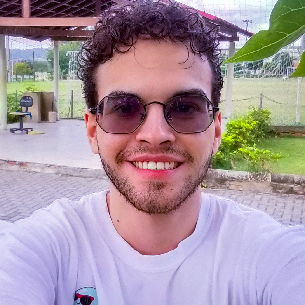

## Sobre Mim

Sou natural de *Pombal/PB*, mas desde 2022 resido em *Campina Grande/PB*. 
Atualmente, curso *Ciência da Computação* na *Universidade Federal de Campina Grande (UFCG)*, onde estou no quarto período. 

---

## Conquistas

- **2019**: Medalhista de Bronze na Olimpíada Brasileira de Matemática das Escolas Públicas (OBMEP)
- **2020**: Medalhista de Prata na Olimpíada Brasileira de Matemática das Escolas Públicas (OBMEP)
- **2022**: Início da graduação em Ciência da Computação na Universidade Federal de Campina Grande (UFCG)
- **Novembro/2024**: Ingresso no projeto **Agents4Good** – Parceria entre a UFCG e KunumiAI, focado em Inteligência Artificial

---

## Experiências

- **Iniciação Científica OBMEP**  
  *Jan/2020 – Dez/2020*  
  Participei do programa de iniciação científica com bolsa do CNPq, com foco no desenvolvimento de métodos de ensino e aprendizagem para estudantes da OBMEP.

- **Monitor Bolsista FMCC1**  
  *Jun/2022 – Dez/2022*  
  Atuei como monitor bolsista na disciplina FMCC1, sendo responsável pela correção de atividades e fornecendo suporte aos alunos durante o curso.

- **Monitor Voluntário LP2**  
  *Fev/2023 – Jun/2023*  
  Fui monitor voluntário na disciplina de Linguagens de Programação 2 (LP2), auxiliando na correção de laboratórios e apoiando os alunos em sala de aula.

- **Pausa na Carreira**  
  *Jun/2023 – Jun/2024*  
  Durante esse período, fiz uma pausa no curso para focar em questões pessoais, sem deixar de buscar aprimoramento acadêmico e profissional.

- **Monitor Voluntário FMCC1**  
  *Jul/2024 – Out/2024*  
  Retornei como monitor voluntário na disciplina FMCC1, auxiliando novamente na correção de atividades e no acompanhamento dos alunos.

- **Projeto Agents4Good**  
  *Nov/2024 – até o momento*  
  Participando de pesquisas e desenvolvimentos em **Inteligência Artificial**, com ênfase em **Sistemas Multiagentes** e **Modelos de Linguagem de Grande Escala (LLMs)**. O projeto é uma parceria entre a UFCG e a [KunumiAI](https://www.kunumi.com/).

---

Agradeço pelo seu interesse em conhecer mais sobre minha trajetória.  
Se você deseja entrar em contato ou discutir projetos, sinta-se à vontade para me chamar pelas redes sociais.
